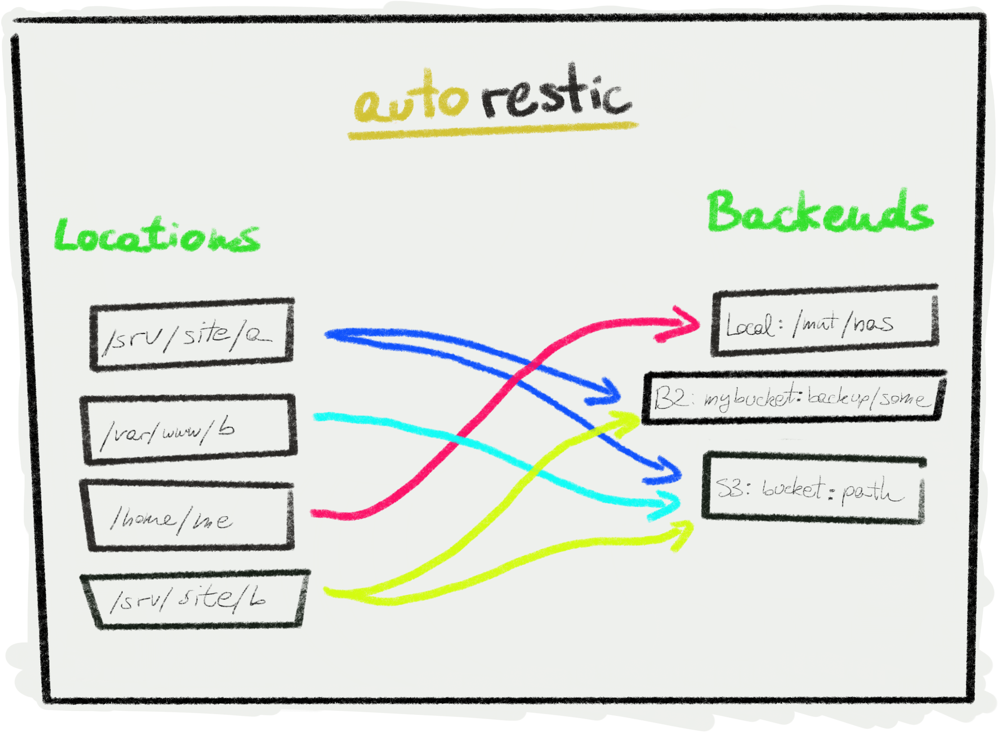

# autorestic
High backup level CLI utility for [restic](https://restic.net/).

Autorestic is a wrapper around the amazing [restic](https://restic.net/). While being amazing the restic cli can be a bit overwhelming and difficoult to manage if you have many different location that you want to backup to multiple locations. This utility is aimed at making this easier 🙂



## 🌈 Features

- Config files, no CLI
- Predictable
- Backup locations to multiple backends
- Snapshot policies and pruning
- Simple interface
- Fully encrypted

## Installation

```
curl -s https://raw.githubusercontent.com/CupCakeArmy/autorestic/master/install.sh | bash
```

## 🚀 Quickstart

### Setup

First we need to configure our locations and backends. Simply create a `.autorestic.yml` either in your home directory of in the folder from which you will execute `autorestic`.

Optionally you can specify the location of your config file by passing it as argument: `autorestic -c ../path/config.yml`

```yaml
locations:
  home:
    from: /home/me
    to: remote

  important:
    from: /path/to/important/stuff
    to:
      - remote
      - hdd

backends:
  remote:
    type: b2
    path: 'myBucket:backup/home'
    B2_ACCOUNT_ID: account_id
    B2_ACCOUNT_KEY: account_key

  hdd:
    type: local
    path: /mnt/my_external_storage
```

Then we check if everything is correct by running the `check` command. We will pass the `-a` (or `--all`) to tell autorestic to check all the locations.

Lets see a more realistic example (from the config above)

```
autorestic check -l important
```

If we would check only one location we could run the following: `autorestic -l home check`.

### Backup

```
autorestic backup -a
```

### Restore

```
autorestic restore -a -- --target /path/where/to/restore
```

This will restore all the locations to the selected target. If for one location there are more than one backends specified autorestic will take the first one.

```
autorestic restore -l home --from hdd -- --target /path/where/to/restore
```

This will restore the location `home` to the `/path/where/to/restore` folder and taking the data from the backend `hdd`


## 🗂 Locations

A location simply a folder on your machine that restic will backup. The paths can be relative from the config file. A location can have multiple backends, so that the data is secured across multiple servers.

```yaml
locations:
  my-location-name:
    from: path/to/backup
    to:
      - name-of-backend
      - also-backup-to-this-backend
```

## 💽 Backends

Backends are the place where you data will be saved. Backups are incremental and encrypted.

### Fields

##### `type`

Type of the backend see a list [here](https://restic.readthedocs.io/en/stable/030_preparing_a_new_repo.html)

Supported are:
- [Local](https://restic.readthedocs.io/en/stable/030_preparing_a_new_repo.html#local)
- [Backblaze B2](https://restic.readthedocs.io/en/stable/030_preparing_a_new_repo.html#backblaze-b2)
- [Amazon S3](https://restic.readthedocs.io/en/stable/030_preparing_a_new_repo.html#amazon-s3)
- [Minio](https://restic.readthedocs.io/en/stable/030_preparing_a_new_repo.html#minio-server)
- [Google Cloud Storage](https://restic.readthedocs.io/en/stable/030_preparing_a_new_repo.html#google-cloud-storage)
- [Microsoft Azure Storage](https://restic.readthedocs.io/en/stable/030_preparing_a_new_repo.html#microsoft-azure-blob-storage)

For each backend you need to specify the right variables as shown in the example below.

##### `path`

The path on the remote server.
For object storages as

##### Example

```yaml
backends:
  name-of-backend:
    type: b2
    path: 'myAccount:myBucket/my/path'
    B2_ACCOUNT_ID: backblaze_account_id
    B2_ACCOUNT_KEY: backblaze_account_key
```

## Pruning and snapshot policies

Autorestic supports declaring snapshot policies for location to avoid keeping old snapshot around if you don't need them.

This is based on [Restic's snapshots policies](https://restic.readthedocs.io/en/latest/060_forget.html#removing-snapshots-according-to-a-policy), and can be enabled for each location as shown below:

```yaml
locations:
  etc:
    from: /etc
    to: local
    keep:
      # options matches the --keep-* options used in the restic forget CLI
      # cf https://restic.readthedocs.io/en/latest/060_forget.html#removing-snapshots-according-to-a-policy
      last: 5             # always keep at least 5 snapshots
      hourly: 3           # keep 3 last hourly shapshots
      daily: 4            # keep 4 last daily shapshots
      weekly: 1           # keep 1 last weekly shapshots
      monthly: 12         # keep 12 last monthly shapshots
      yearly: 7           # keep 7 last yearly shapshots
      within: "2w"        # keep snapshots from the last 2 weeks
```

Pruning can be triggered using `autorestic forget -a`, for all locations, or selectively with `autorestic forget -l <location>`. **please note that contrary to the restic CLI, `restic forget` will call `restic prune` internally.**


Run with the `--dry-run` flag to only print information about the process without actually pruning the snapshots. This is especially useful for debugging or testing policies:

```
$ autorestic forget -a --dry-run --verbose

Configuring Backends
local : Done ✓

Removing old shapshots according to policy
etc ▶ local : Removing old spnapshots… ⏳
etc ▶ local : Running in dry-run mode, not touching data
etc ▶ local : Forgeting old snapshots… ⏳Applying Policy: all snapshots within 2d of the newest
keep 3 snapshots:
ID        Time                 Host        Tags        Reasons    Paths
-----------------------------------------------------------------------------
531b692a  2019-12-02 12:07:28  computer                within 2w  /etc
51659674  2019-12-02 12:08:46  computer                within 2w  /etc
f8f8f976  2019-12-02 12:11:08  computer                within 2w  /etc
-----------------------------------------------------------------------------
3 snapshots
```

##### Note

Note that the data is automatically encrypted on the server. The key will be generated and added to your config file. Every backend will have a separate key. You should keep a copy of the keys somewhere in case your server dies. Otherwise DATA IS LOST!

## Contributors

This amazing people helped the project!

- @ChanceM [Docs]
- @EliotBerriot [Docs, Pruning, S3]
